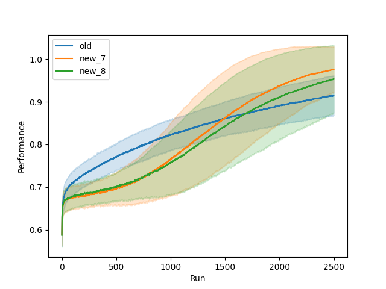
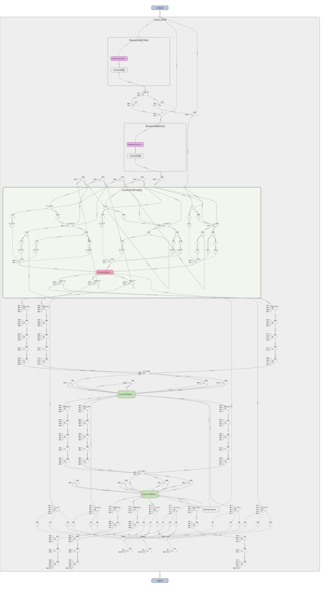

### Overview  

Currently work is being done on implementing an actor critic model with clustering action space. For details on current development see AC_New/TODO.txt


To run 

``` 
$ cd AC_New 

$ python AC_driver.py 
``` 

### Initial Results
Baselines with N=15, K=12, Nodes=36, Clusters=6 and there are 330 aggregate trials


**Model Architecture**



### Important Files/Directories 

```bash
AC_New
├── AC_driver.py:         File outlines the training loop and calls high level functions
├── AC_helper.py:         File containing technical elements of the training loop
├── Autoencoder.py:       File containing the actor critic class
├── ConvLSTM_Imp.py:      File containing the classes implementing a ConvLSTM in pytorch
├── Original_NK.py:       File containing the original nk_landscape code
├── generate_graphs.py:   File which generates diagrams
├── new_graph.py:         File containing the updated version of the partial copying social network
├── outputs:              Directory containing performance graphs
└── tester.py:            File containing utility/testing script
```

### Directory Overview 
```bash
├── AC_New
│   └── outputs:           Directory containing performance graphs
├── CythonMods             Cythoized versions of basic utility functions used in  
│                               the first AC model and Simulated annealing
├── MCMC:                  For future implementations of Markov Decision Processes 
├── Older_Work:            Attempt 1 at the AC model, an adapted GRU model, and 
│                               Simulated Annealing 
├── images:                Contains graphs of first/old AC trials 
├── jl_tests:              Partial Implementation of social graphs in julia
└── playground:            Area to test python code
```